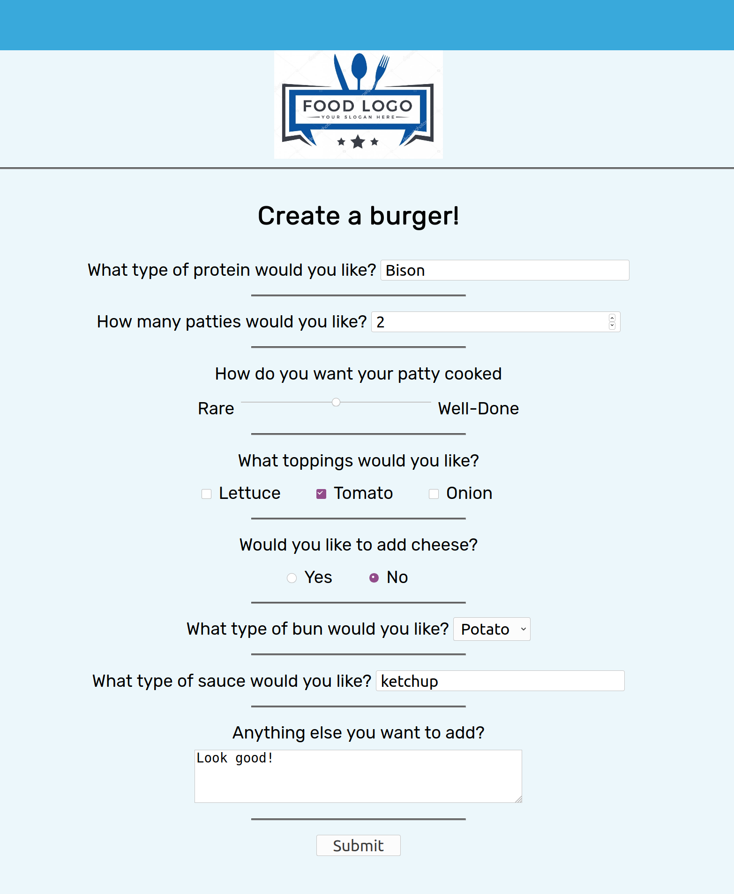

# FrontEndDevProjects
<h2> I've compiled a set of projects :</h2>
  
<ol>
  <li><h3>Restuarant Menu Selection</h3></li>
  
 Sample UI that allows a user to select items from a menu.  Key Features:

  <ul>
     <li>drop down selection</li>
     <li>sliding scale</li>
      <li>radio buttons</li>
       <li>checkboxes</li>
      <li>submission</li>
      <li>type selection</li>
     </ul>

   
  <li><h3>Typography</h3></li>
    
  
  
Sample reference sheet of common typescript

  
Key features:

  <ul>
    <li>@font-face reference</li>
    <li>API font links</li>
  </ul>
</ol>
  
 

